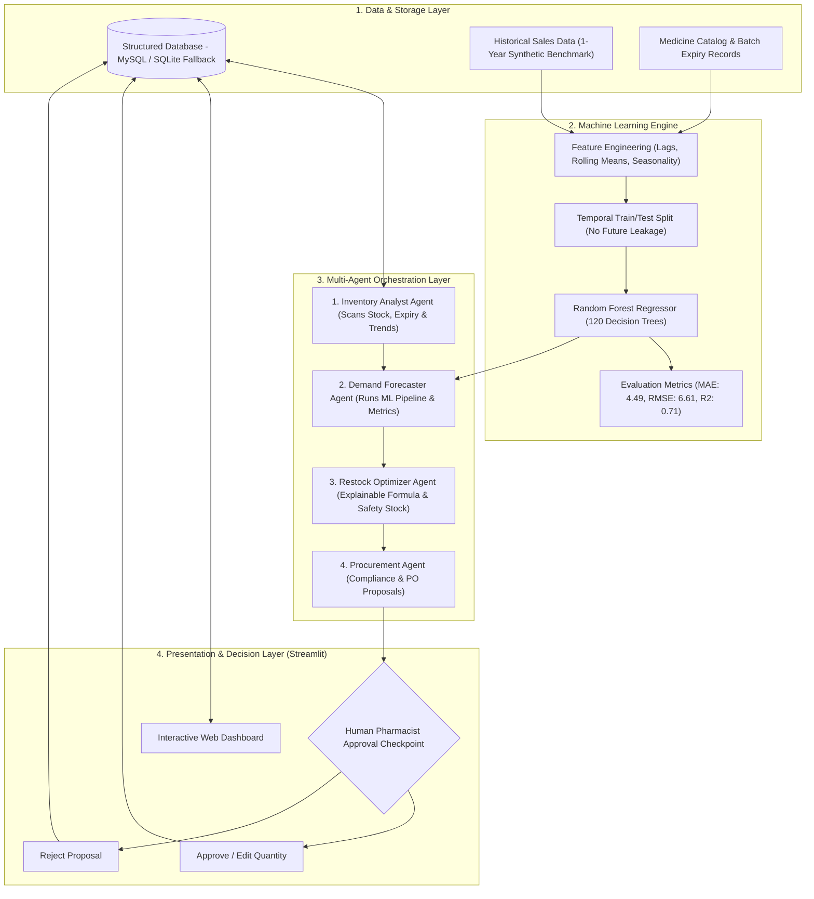

# Health Supply AI: Medicine Demand Prediction & Smart Restocking Using Agentic AI

[](https://www.python.org/)
[](https://streamlit.io/)
[](https://scikit-learn.org/)
[](https://www.sqlalchemy.org/)
[]()

> **B.Tech Mini-Project (Review-1 Implementation)**  
> **Institution:** Vardhaman College of Engineering (Autonomous), Hyderabad  
> **Department:** Department of Computer Science and Engineering (Data Science)  
> **Batch ID:** `24MPCSD-B07` | **Academic Year:** 2026–27 (Batch 2024–28)  
> **Project Guide:** Mr. V Vinod Kumar, Assistant Professor (CSE - Data Science)  
> **Team Members:**
> - Bamandla Deekshitha (`24881A6774`)
> - K Lohith Reddy (`24881A6787`)
> - Ramasani Shivanand (`24881A67B5`)

---

## 1. Project Overview & Problem Statement

Conventional retail and hospital pharmacies rely heavily on reactive, manual inventory tracking or static Min-Max stock counting. This leads to two critical operational problems:
1. **Medicine Stockouts:** Unavailability of vital and acute medications during sudden demand surges (seasonal viral outbreaks, monsoon fevers, pollen allergy spikes), directly endangering patient care and losing revenue.
2. **Overstocking & Wastage:** Over-purchasing slow-moving medicines leads to capital lock-up and costly batch expirations that must be discarded at a complete financial loss.

**Health Supply AI** is an intelligent, data-driven **pharmacy inventory decision-support system**. It unites **supervised machine learning (Random Forest Regression)** for multi-horizon demand forecasting with an **autonomous 4-agent collaborative pipeline** and **explainable replenishment logic**, protected by a **Human-in-the-Loop (HITL)** authorization mechanism.

> [!IMPORTANT]
> **Clinical Boundary Disclaimer:**  
> Health Supply AI is an **inventory operations decision-support system**, not a medical diagnostic or prescription system. It does not analyze patient health records or recommend clinical drug therapies.

---

## 2. System Architecture



---

## 3. The 4 Autonomous Agents

The system orchestrates four specialized agents to perform end-to-end inventory governance:

| # | Agent Name | Primary Responsibility | Sample User-Facing Activity Log |
|---|---|---|---|
| **1** | **Inventory Analyst Agent** | Queries current stock, reorder levels, shelf-life expiry, and evaluates 30-day dispensation velocity to detect trends (*Surging*, *Stable*, *Declining*). | `✓ Inventory Agent — Retrieved stock data (45 units, Low Stock) & detected 'Stable Demand' pattern for Paracetamol 650mg` |
| **2** | **Demand Forecaster Agent** | Executes the trained Random Forest model across the target horizon (7, 14, 30 days) and reports evaluation metrics (MAE, RMSE). | `✓ Forecast Agent — Generated 7-day forecast (360 units) via Random Forest (MAE: 4.49, RMSE: 6.61)` |
| **3** | **Restock Optimization Agent** | Computes replenishment requirements using explainable formula: `max(0, Predicted Demand + Safety Stock - Current Stock)` and assigns priority (*Critical, High, Medium, Low*). | `✓ Restock Agent — Calculated replenishment (350 units, Priority: Critical) via: max(0, 360 [Demand] + 35 [Safety] - 45 [Stock])` |
| **4** | **Procurement & Compliance Agent** | Validates proposal against supplier lead times and pricing constraints, constructs a formal Purchase Order proposal, and awaits human sign-off. | `⚠ Procurement Agent — Generated PO Proposal for 350 units (Est. INR 11,375.00) with Apex Pharma. Awaiting Approval.` |

---

## 4. Key Application Modules

1. **Dashboard Overview:** Real-time KPI summary (Total SKUs, Stock count, Valuation, Active Alerts, Pending Orders), Stock vs. Reorder Level comparison chart, and top-selling medicines.
2. **Medicine Inventory:** Searchable and filterable medicine catalog with real-time stock status badges, expiry proximity countdowns, new medicine registration, and quick stock adjustments.
3. **Sales History & Dispensation:** Point-of-sale dispensation logger with automatic stock decrement, date-filtered transaction audit log, dispensation trend visualizer, and CSV bulk import/template download.
4. **Demand Forecasting:** Medicine selector with variable horizon (7, 14, 30 days), interactive Plotly chart combining 30 days of actual sales with future predicted demand curves and reference stock lines.
5. **Smart Restocking:** Full mathematical explainability of replenishment recommendations, safety stock buffers ($SS = Z \times \sigma \times \sqrt{L}$), and catalog-wide batch restock trigger.
6. **Alerts Center:** Automated early warnings for Low Stock, Expiry Risks (<90 days and <30 days), and Sudden Demand Surges (>40% increase over baseline).
7. **Agent Activity Console:** Interactive execution of the 4-agent sequential workflow with live color-coded status badges and instant proposal approval.
8. **Procurement & Human Approvals:** Human-in-the-Loop decision terminal allowing the pharmacist to **Approve**, **Edit Quantity**, or **Reject** purchase orders, with optional delivery receipt simulation.
9. **Model Performance & Analytics:** Transparent ML diagnostics displaying MAE, RMSE, $R^2$ Score, comparative algorithm benchmarks (Random Forest vs. Linear Regression), Hold-out Test Actual vs. Predicted curves, and Gini Feature Importances.

---

## 5. Technology Stack

- **Programming Language:** Python 3.10+ (tested on Python 3.14)
- **Web Application Framework:** Streamlit
- **Machine Learning & Analytics:** Scikit-Learn, Pandas, NumPy
- **Interactive Visualizations:** Plotly Express & Plotly Graph Objects
- **Database & Object Relational Mapper:** MySQL + SQLAlchemy (with zero-configuration SQLite fallback)
- **Model Serialization:** Joblib
- **Testing Framework:** Python `unittest` / automated test runner

---

## 6. Machine Learning Methodology

### 6.1 Feature Engineering (25 Features)
- **Autoregressive Lags:** `lag_1`, `lag_2`, `lag_3`, `lag_7` (weekly seasonality), `lag_14`, `lag_30`.
- **Rolling Windows:** `rolling_mean_7`, `rolling_std_7` (demand volatility), `rolling_mean_14`, `rolling_mean_30`, `rolling_max_7`, `rolling_min_7`.
- **Demand Momentum:** Ratio of 7-day to 30-day rolling mean to detect acceleration or deceleration.
- **Calendar & Refill Cycles:** `dayofweek`, `is_weekend`, `month`, `quarter`, `is_month_start` (payday/refill surges), `is_month_end`.
- **Trigonometric Cyclical Transformations:** `sin_dayofyear`, `cos_dayofyear`, `sin_month`, `cos_month`.

### 6.2 Prevention of Time-Series Data Leakage
- **Strict Lag Shifting:** All rolling and lag features use `df.shift(1)`—no information from day $t$ or later is ever used to predict day $t$.
- **Temporal Train/Test Split:** Standard randomized shuffling was avoided. The dataset was chronologically split: the first ~10 months were used for training, and the final 60 days were strictly reserved for held-out evaluation.

### 6.3 Evaluation Results Benchmark

| Metric | Random Forest Regressor (Proposed) | Linear Regression (Baseline) |
|---|---|---|
| **Mean Absolute Error (MAE)** | **4.49 units** | 4.63 units |
| **Root Mean Squared Error (RMSE)** | **6.61 units** | 6.83 units |
| **Coefficient of Determination ($R^2$)** | **0.705 (70.5%)** | 0.685 (68.5%) |
| **Non-Linear Demand Capture** | Superior (Ensemble decision trees) | Limited (Linear assumption) |

---

## 7. Project Directory Structure

```text
health-supply-ai/
├── app.py                      # Main Streamlit application entry point
├── config.py                   # Central configuration & database connection routing
├── requirements.txt            # Python dependencies
├── .env.example                # Environment variables template
├── .gitignore                  # Git ignore rules
├── README.md                   # Comprehensive project documentation
├── agents/                     # 4-Agent Orchestration Subsystem
│   ├── __init__.py
│   ├── state.py                # Shared workflow state & activity logging schema
│   ├── inventory_agent.py      # Agent 1: Inventory Analyst Agent
│   ├── demand_agent.py         # Agent 2: Demand Forecaster Agent
│   ├── restock_agent.py        # Agent 3: Restock Optimization Agent
│   ├── procurement_agent.py    # Agent 4: Procurement & Compliance Agent
│   └── orchestrator.py         # Multi-agent coordinator
├── database/                   # Relational Persistence Layer
│   ├── __init__.py
│   ├── connection.py           # SQLAlchemy engine with SQLite auto-fallback
│   └── models.py               # SQLAlchemy models (Medicine, SalesRecord, etc.)
├── data/                       # Data Generators & Seeding
│   ├── __init__.py
│   ├── synthetic_generator.py  # 1-year realistic pharmacy sales generator
│   └── seed_data.py            # Database initialization and seeding script
├── ml/                         # Machine Learning Pipeline
│   ├── __init__.py
│   ├── feature_engineering.py  # Lag, rolling, and cyclical feature builders
│   ├── train_model.py          # Temporal split, model training & metrics evaluator
│   └── predictor.py            # Recursive multi-step time-series predictor service
├── services/                   # Application Business Logic
│   ├── __init__.py
│   ├── inventory_service.py    # Medicine catalog operations & KPI aggregator
│   ├── sales_service.py        # Transaction logging, date filters & CSV import
│   ├── alert_service.py        # Low-stock, expiry, and surge alert detectors
│   └── restock_service.py      # Replenishment math, approval & order fulfillment
├── ui/                         # Streamlit UI Views & Visualizations
│   ├── __init__.py
│   ├── components.py           # Professional healthcare CSS, KPI cards & badges
│   ├── dashboard_view.py       # Main intelligence dashboard view
│   ├── inventory_view.py       # Inventory catalog & stock editor view
│   ├── sales_view.py           # Sales transaction logger & timeline view
│   ├── forecast_view.py        # Interactive ML demand forecasting view
│   ├── restock_view.py         # Smart restocking matrix & formula breakdown view
│   ├── alerts_view.py          # Early warning alerts center view
│   ├── procurement_view.py     # Human-in-the-loop approval & audit trail view
│   ├── agent_activity_view.py  # Live agent workflow console view
│   └── model_eval_view.py      # ML diagnostics, MAE/RMSE & feature importances view
├── tests/                      # Automated Verification & Test Suite
│   ├── __init__.py
│   ├── test_database.py        # Database models & CRUD test
│   ├── test_ml_pipeline.py     # Feature engineering, training & predictor test
│   ├── test_agents.py          # 4-agent workflow & human approval test
│   └── run_all_tests.py        # Master test runner
├── models/                     # Saved Model Artifacts
│   ├── random_forest_demand_model.joblib
│   ├── model_metrics.json
│   └── feature_names.json
└── docs/
    └── VIVA_GUIDE.md           # 35 technical viva questions & answers
```

---

## 8. Installation & Setup

### Prerequisites
- Python 3.10 or higher installed
- Git installed (optional)

### Step 1: Clone or Navigate to Project Directory
```powershell
cd "C:\Users\LOHITH REDDY K\.gemini\antigravity\scratch\health-supply-ai"
```

### Step 2: Install Dependencies
```powershell
pip install -r requirements.txt
```

### Step 3: Configure Database (Optional)
By default, the application **automatically uses SQLite with zero configuration**, ensuring it runs instantly without any setup.

To connect your local MySQL database instead:
1. Copy `.env.example` to `.env`:
   ```powershell
   copy .env.example .env
   ```
2. Open `.env` and configure your MySQL credentials:
   ```ini
   DB_TYPE=mysql
   DB_USER=root
   DB_PASSWORD=your_mysql_password
   DB_HOST=localhost
   DB_PORT=3306
   DB_NAME=health_supply_ai
   ```

---

## 9. How to Run the Application

### Launch the Streamlit Web Application
```powershell
streamlit run app.py
```
Once launched, open your web browser at:
`http://localhost:8501`

### Run Master Automated Test Suite
To verify database operations, feature engineering, ML models, and multi-agent coordination:
```powershell
python -m tests.run_all_tests
```
**Expected Output:**
```text
=================================================================
  HEALTH SUPPLY AI: COMPREHENSIVE AUTOMATED VERIFICATION SUITE
=================================================================

[RUNNING] Database Models & CRUD Operations...
✓ test_database_crud PASSED

[RUNNING] Feature Engineering & Leakage Check...
✓ test_feature_engineering PASSED

[RUNNING] Random Forest Training & MAE/RMSE...
✓ test_model_training_and_metrics PASSED (MAE=4.49, RMSE=6.61, R2=0.705)

[RUNNING] Multi-Horizon Demand Predictor...
✓ test_predictor_forecast PASSED

[RUNNING] 4-Agent Sequential Workflow Execution...
✓ test_agent_workflow_execution PASSED (All 4 agents executed in sequence)

[RUNNING] Human-in-the-Loop Approval & Stock Update...
✓ test_human_approval_lifecycle PASSED (HITL Edit & Approval confirmed)

=================================================================
  TEST RESULTS: 6 PASSED, 0 FAILED (TOTAL: 6)
=================================================================
```

---

## 10. End-to-End Demo Workflow for Viva Examination

Follow these steps for a complete project demonstration:

1. **Dashboard Overview:**  
   Launch `app.py`. View the KPI metrics cards (Total SKUs, Stock on Hand, Inventory Valuation, Active Alerts). Point out the comparative chart of **Current Stock vs. Reorder Level**.
2. **Review Real-Time Alerts:**  
   Navigate to **Alerts**. Show how the system proactively detected medicines with low stock (e.g., *Insulin*, *Cetirizine*, *Ascoril*) and near-expiry batches (<90 days).
3. **ML Demand Prediction:**  
   Navigate to **Demand Forecast**. Select `Paracetamol 650mg`, choose a `7 Days` horizon, and click **Generate Prediction**. Show the seamless curve transitioning from actual historical sales to the Random Forest forecast.
4. **Smart Restocking Logic:**  
   Navigate to **Smart Restocking**. Point to the mathematical formula:
   $$\text{Recommended Restock} = \max(0, \text{Predicted Demand} + \text{Safety Stock} - \text{Current Stock})$$
   Explain how the safety stock buffer protects against unexpected delivery delays during the supplier lead time.
5. **Multi-Agent Orchestration:**  
   Navigate to **Agent Activity**. Select a low-stock medicine and click **Trigger Agent Workflow**. Observe the 4 agents executing in sequence:
   - *Inventory Agent* retrieves stock and detects demand trend.
   - *Forecast Agent* executes Random Forest and reports MAE (4.49) & RMSE (6.61).
   - *Restock Agent* computes exact replenishment units.
   - *Procurement Agent* structures the purchase order and marks it `Awaiting Approval`.
6. **Human-in-the-Loop Approval:**  
   Navigate to **Procurement Approvals**. Review the pending proposal. Demonstrate the human authorization power by editing the quantity or approving the order. Check the option to simulate immediate delivery receipt and watch the inventory stock increment in real time.
7. **Model Diagnostics & Verification:**  
   Navigate to **Model Performance**. Present the MAE, RMSE, and $R^2$ metrics, the comparative benchmark against Linear Regression, the Actual vs. Predicted curves on the hold-out test set, and the Gini feature importances.

---

## 11. Viva Defense Guide

A comprehensive viva preparation document containing **35 in-depth technical questions and implementation-matched answers** is located at:
`docs/VIVA_GUIDE.md`

Topics covered:
- Random Forest theory, decision tree ensembles, and bagging.
- MAE vs. RMSE mathematical derivations and clinical interpretation.
- Prevention of time-series data leakage and temporal splitting.
- Safety stock derivation using normal service factors ($Z = 1.65$).
- Reorder Point (ROP) calculation.
- Agentic AI workflow vs. monolithic architectures.
- Human-in-the-loop compliance safeguards.

---

## 12. Academic Credentials

- **Institute:** Vardhaman College of Engineering (Autonomous), Shamshabad, Hyderabad
- **Department:** Computer Science and Engineering (Data Science)
- **Course:** III B.Tech I Semester (Mini Project Review-1)
- **Batch:** 2024–28 | **Academic Year:** 2026–27
- **Batch ID:** `24MPCSD-B07`
